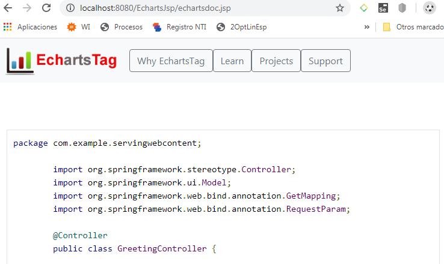

# EchartsTag
EchartsTag is a graphics project for Java, it is still in development, for any suggestion or improvement contribution you can write to me by email (mamanipari@gmail.com) or WhatsApp (951782520), I am from Peru and my official language is Spanish.


## Steps to create a project

Step 1: To test you can create any Maven type project in Java (for example with the name of: EchartsJsp)

Step 2: Inside the pom.xml file put the following code that refers to the repository from where the library will be downloaded.
#### pom.xml
```xml
    <repositories>
            <repository>
                <id>jitpack.io</id>
                <url>https://jitpack.io</url>
            </repository>
    </repositories>
```
Step 3: Then Add the following dependency.

```xml
	<dependency>
	    <groupId>com.github.davidmp</groupId>
	    <artifactId>EchartsTag</artifactId>
	    <version>1.4</version>
	</dependency>
```
Step 4: Inside the Java Resources folder create a properties file with the following name syscenterlife.properties and inside it place the following content:
#### syscenterlife.properties
```properties
echarts.theme.name=default
echarts.lang.name=es
```

Step 5: Run your project with a content server, preferably Tomcat version 9 onwards and place in your browser http://localhost:8080/EchartsJsp/echartsdoc.jsp and the documentation on how to use it will appear.




If you want some examples you can see them in the following Github repository [Examples of Echart Projects](https://github.com/davidmp/ExampleFrameworkEcharts)

## Citación

[EchartsTag para Generación de Charts usando Taglib](https://revistas.ulima.edu.pe/index.php/Interfases/article/view/5394)

```BibTeX
@article{Mamani-Pari_Escobedo-Quispe_2021, 
title={EchartsTag para Generación de Charts usando Taglib}, 
url={https://revistas.ulima.edu.pe/index.php/Interfases/article/view/5394}, 
DOI={10.26439/interfases2021.n014.5394}, 
abstractNote={&lt;p&gt;Existen muchas herramientas para desarrollar aplicaciones en Java, pero existen pocas alternativas para Framework o bibliotecas especializadas para mostrar gráficos (Charts) en entornos web. Aunque la mayoría son para entornos de escritorio, las librerías PrimeFaces y ChartistJSF son una alternativa para la web, pero están orientadas a proyectos basados en Java Server Faces. En este sentido, muchos proyectos prefieren utilizar principalmente una biblioteca de gráficos integrada con JavaScript, lo que implica una curva de aprendizaje adicional y requiere más tiempo en el desarrollo de aplicaciones. Por lo tanto, es necesario tener una biblioteca o marco de visualización de gráficos único para aplicaciones Java en el entorno web. Por lo tanto, en este artículo se propone construir una herramienta que ayude a desarrollar visualizaciones gráficas en proyectos web Java utilizando los conceptos de TagLibs y Webjars. La herramienta propuesta se llama EchartsTag, y fue construida siguiendo la metodología XP y validada el producto con SonarQube y un grupo de profesionales expertos en desarrollo de proyectos Java. EchartsTag está disponible en GitHub, por lo que puede ser utilizado por cualquier desarrollador de la comunidad de Java u organizaciones que trabajen con tecnología Java. Finalmente, los resultados de rendimiento de EchartsTag se demuestran al comparar con otras herramientas alternativas, logrando un tiempo promedio de 14.17 minutos en tiempo de desarrollo y ocupando el tercer lugar en tiempo promedio de visualización que es 3.5ms después de Chartjs y HighChats. Además, ocupa el primer lugar en la evaluación de otros criterios para el desarrollo web java con herramientas de visualización de gráficos.&lt;/p&#38;gt;}, 
number={014}, 
journal={Interfases}, 
author={Mamani-Pari, David and Escobedo-Quispe, Richart Smith}, 
year={2021}, 
month={oct.}, 
pages={e5394} }
```
